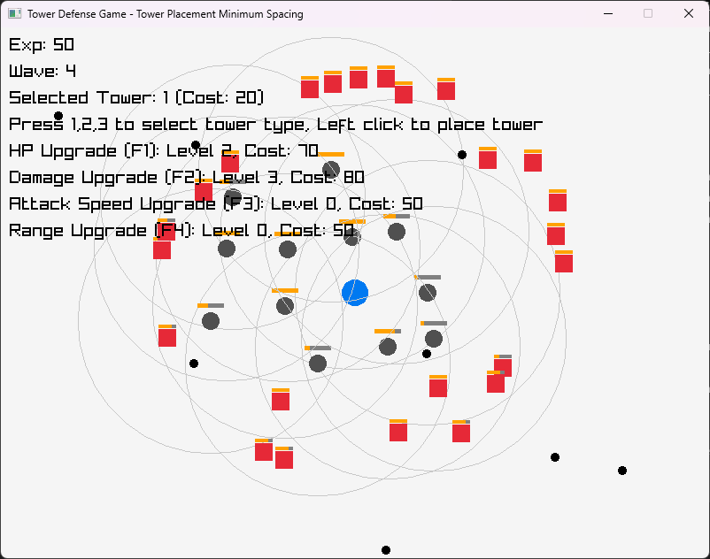

# TinyTower 🎮🌟

TinyTower is an AI-generated tower defense game prototype built with the power of Go, raylib-go, chipmunk, and ChatGPT! 🤖✨



## Overview 📖

TinyTower challenges you to strategically place and upgrade towers to fend off increasingly formidable waves of enemies. This game was conceived and crafted with AI assistance, showcasing innovative design and rapid prototyping techniques. Key features include:
- Tower purchase and placement mechanics with minimum spacing rules
- Upgradable tower stats with visual health bars
- Wave-based enemy spawning with scaled difficulty
- Dynamic visual feedback and engaging gameplay elements

## Powered By 🔥

- **Golang** – A robust and efficient programming language
- **raylib-go** – A delightful library for creating charming visuals
- **chipmunk** – A smooth physics engine for realistic interactions
- **ChatGPT** – Our AI partner that helped generate game design ideas

## How to Run 🏃‍♂️

```bash
go get github.com/gen2brain/raylib-go/raylib
go get github.com/jakecoffman/chipmunk
go run .
```
